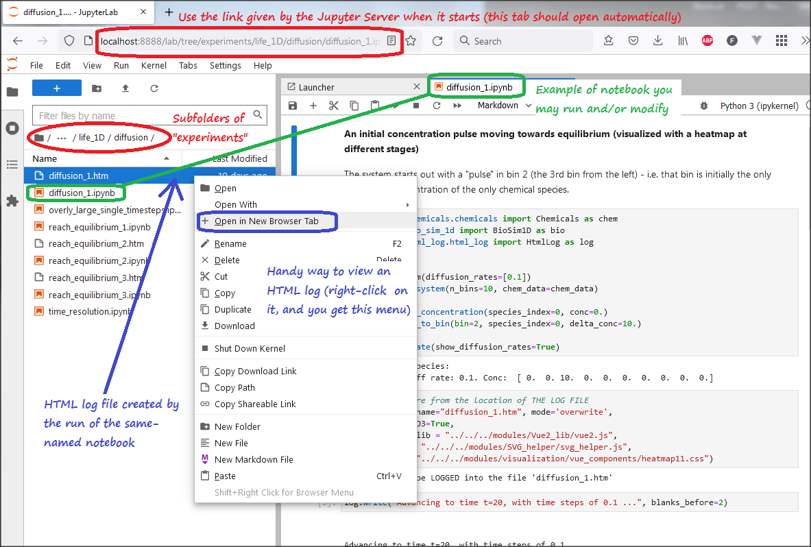
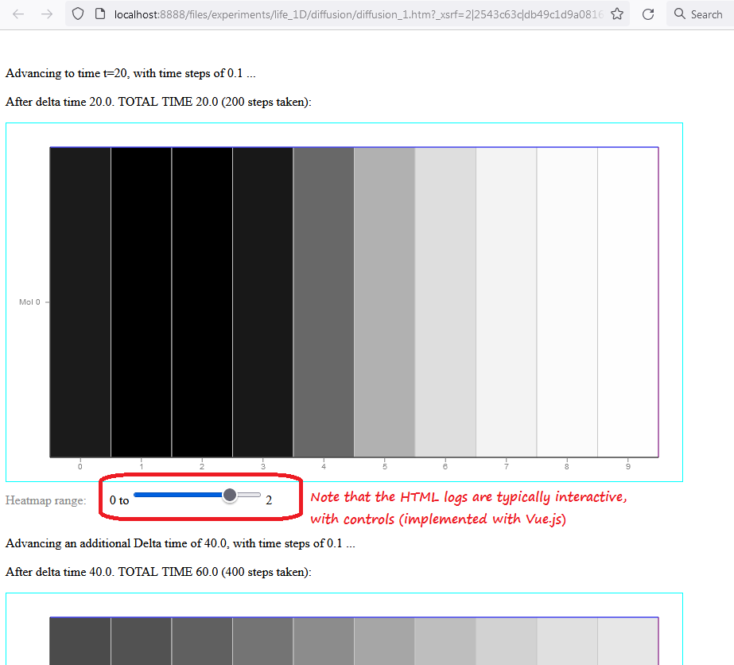

### VERSION 1.0-beta16 IN_PROGRESS

# Life123
Detailed quantitative modeling of biological systems in 1, 2 and 3D

Including diffusion, reactions, membranes and compartments.

## Fundamental Goals
1. Detailed, quantitative biological simulations, including whole prokaryotic cells (bacteria), and later eukaryotic cells
2. Deeper quantitative insight into human tissue/organ/system physiology, for the advancement of medicine
3. A very integrative approach that is ultimate conducive to body-wide insights,
   with an eye to Longevity Science
4. Explore the minimalist essence of life-like dynamical systems
5. Investigate potential paths for the emergence of life on Earth and on Exoplanets
6. A community effort bringing together biologists, system biologists, programmers, machine-learning specialists, biochemists, power-computing engineers, doctors, data scientists, graphic designers, members of the public willing to share computing resources, etc.

## Overview and Details
[Project Announcement](https://julianspolymathexplorations.blogspot.com/2022/03/life123-systems-biology-modeling.html)

[WEBSITE](https://life123.science/)

[Follow our blog/discussions](https://github.com/BrainAnnex/life123/discussions)

## Try it Out Live on a hosted JupyterLab!
**TRY IT OUT LIVE** (no registration nor install!)  
Click on

Then explore the notebooks under the `experiments` folder.

Note that several notebooks create **HTML log files**, by the same name as the notebook (eg,
running the notebook called `diffusion_1.ipynb` will create a log file named `diffusion_1.htm`).
These log files typically contain the output of the runs, nicely formatted, plus interactive graphics: see
screenshots under the *"QUICK-AND-EASY method"* section, below.

"Binder", the host of the live demo, is akin to Google's Colab:
short-term runs on a hosted JupyterLab environment.  
It generally takes less than one minute to launch... and then you'll have your own private copy of all the notebooks,
to run and/or change and re-run.  (`.htm` log files are generally pre-existing; you may view them without
having to run anything.)

Please remember that nothing gets saved long term on Binder; so, if you make changes you want to preserve,
make sure to download the changed notebooks!  For instruction on creating your own private local copy, read on...

## Components
* life_1D
* life_2D
* life_3D
* experiments

*Common modules:*

* chemicals
* heuristics
* html_log
* reactions
* SVG_helper
* visualization
* Vue2_lib

*Unit Testing (pytest):*
* tests

## How to Use
See the annotated examples in the [experiments](https://github.com/BrainAnnex/life123/tree/main/experiments/life_1D) folder

## How to Run
Copy the files from the repository to your local machine.  (If you just want to a live demo, see the earlier section on that.)

On a Linux machine, you can use the command:

    sudo git clone --verbose --config http.sslVerify=false https://github.com/BrainAnnex/life123.git YOUR_LOCAL_DIRECTORY

Or you could download a zip file from [the repository](https://github.com/BrainAnnex/life123)

Install, if not already present on your machine, Python 3.8+

We currently test on Python 3.8 (earlier versions will NOT work, because of the various libraries).

Note that Python 3.8 is the last version of python still compatible with Win7.

**QUICK-AND-EASY method**

A Colab option is being investigated...

For now, we highly recommend using an IDE, such as PyCharm.  
PyCharm will auto-detect the `requirements.txt` file
and prompt you to create a virtual environment as specified.

Then:
1. edit the folder names in the top-level batch file `quick.bat`, based on your local folder where you installed Life123 (one-time operation)
2. just type `quick` in the *Terminal tab* at the bottom of PyCharm (not to be confused with the "Python Console" tab!)

**That's it!**  A new browser tab will open, and you can review and run the `experiments` notebooks from within JupyterLab!

For the quick-start method, we set things up with _JupyterLab_, because we find it much better than
Jupyter Notebooks!

    "JupyterLab is the next-generation user interface for Project Jupyter  
    offering all the familiar building blocks of the classic Jupyter Notebook  
    in a flexible and powerful user interface.  
    JupyterLab will eventually replace the classic Jupyter Notebook."

Of particular relevance to this project, with _JupyterLab_, you can easily inspect the
HTML log files (with the graphic outputs of program runs): just right-click on them,
and request "Open in New Browser Tab", as shown below:

_and here's that HTML file from above, viewed in a browser:_

## OTHER ways to run Life123 (for more advanced users)

**SET UP the virtual (local) environment**

If you opt to handle setting up the virtual environment yourself, on Linux you can do:

    $ sudo apt install python3.8-venv   (if needed)
    $ python3 -m venv /path_to_root_folder_where_the_files_are/venv
    $ cd source /path_to_root_folder_where_the_files_are
    $ source venv/bin/activate
    (venv) $ pip3 install -r requirements.txt
    (venv) $ deactivate 

(or use `pipenv` or your favorite tool.)

All dependencies (such as NumPy and Jupyter notebooks) are specified in the file `requirements.txt`

**USING the virtual (local) environment**

To use the virtual environment’s packages/resources in isolation (i.e. without an IDE),
you need to “activate” it.  To activate the virtual environment:

*On Linux:*

    $ cd source /path_to_root_folder_where_the_files_are
    $ source venv/bin/activate
    (venv) $         

*On Windows 7, if using the Command Prompt:*

    D:    (or whichever drive you copied the files to)
    cd "\path_to_root_folder_where_the_files_are"
    EXAMPLE:  cd "\Docs\- MY CODE\BioSimulations\life123-Win7\"
    
    .\venv\Scripts\activate
    
    You will now see this prompt:
    (venv) DRIVE_LETTER:\path_to_root_folder_where_the_files_are>

*On Windows 7, if using the PowerShell:*

In order to use the PowerShell on Windows7 to run scripts,
one must first run it with admin privileges, and issue the command  
   `Set-ExecutionPolicy unrestricted` , and then say `Y` to the prompt  
    (disregard the complaints about "the setting is overridden by a policy defined at a more specific scope"!)

    D:    (or whichever drive you copied the files to)
    cd "\path_to_root_folder_where_the_files_are"
    EXAMPLE:  cd "\Docs\- MY CODE\BioSimulations\life123-Win7\"
    
    .\venv\Scripts\activate
    
    You will now see this prompt:
    (venv) PS DRIVE_LETTER:\path_to_root_folder_where_the_files_are>

In either case, notice how *your prompt is now prefixed with the name of your environment (venv, in our case)*.  
This is the indicator that venv is currently active, which means the python executable
will only use this environment’s packages and settings.

**Specifying the root path, and running Python scripts**

When using an IDE such as PyCharm, *the IDE automatically adds the root of the Life123 files* (i.e. the location
of the PyCharm project) to the value of the `sys.path` seen inside the execution of the Python files.

If you opt not to use an IDE, or if you're using Jupyter notebooks (such as the ones provided in Life123's
`experiments` folder), an extra step is necessary.

IMPORTANT: all steps below are AFTER doing the steps described in the earlier section.
You should be in the local environment, and your prompt should be prefixed by (venv)

*On Linux:*

    (venv) $ export PYTHONPATH=$PYTHONPATH:`pwd`/venv/lib/python3.8/site-packages
    (NOTE: you might need to change the path /venv/lib/python3.8/site-packages to whatever is on your machine)
    (venv) $ echo $PYTHONPATH     [To verify]

*On Windows 7, if using the Command Prompt:*

`set PYTHONPATH=.` will add the `path_to_Life123_root_folder` (the current directory) to
the `sys.path`.

You can verify that it got set, by issuing: `set PYTHONPATH`

*On Windows 7, if using the PowerShell:*

`$env:PYTHONPATH="."` will add the `path_to_Life123_root_folder` (the current directory) to
the `sys.path`.

You can verify that it got set, by issuing: `$env:PYTHONPATH`

---
Now, you can issue commands such as:

    python experiments/diagnostics.py            (this script will print out sys.path and some other values)
    python experiments/life_1D/diffusion/reach_equilibrium.py

Note that setting PYTHONPATH to a *dot* will NOT work for Jupyter Notebooks (see the next section.)

**Specifying the root path, and running JupyterLab**

IMPORTANT: all steps below are AFTER doing the steps described in the section about activating the virtual environment.

*On Windows 7, if using the Command Prompt:*

    set PYTHONPATH=\path_to_Life123_root_folder\
    EXAMPLE:  set PYTHONPATH=\Docs\- MY CODE\BioSimulations\life123-Win7\
    You can verify it, by issuing:  set PYTHONPATH

*On Windows 7, if using the PowerShell:*

    $env:PYTHONPATH="\path_to_Life123_root_folder\"
    EXAMPLE:  $env:PYTHONPATH="\Docs\- MY CODE\BioSimulations\life123-Win7\"
    You can verify it, by issuing:  $env:PYTHONPATH

Next, start JupyterLab:

    a) jupyter-lab
    OR
    b) jupyter notebook "path_and_name_of_your_desired_notebook"
        EXAMPLE: jupyter notebook "\Docs\- MY CODE\BioSimulations\life123-Win7\experiments\life_1D\diffusion\reach_equilibrium.ipynb"
    OR
    c) jupyter notebook --notebook-dir="path_and_name_of_your_desired_startup_folder"
        EXAMPLE: jupyter notebook --notebook-dir="\Docs\- MY CODE\BioSimulations\life123-Win7\experiments"
        (note: you will not be able to navigate to the parent of the startup folder!)  

Alternatively, the `quick.bat` file could be run,
after editing it to specify the name of the local folder and, optionally,
to change the requested Jupyter notebook startup folder.

To run it on Windows7 with the command prompt, issue the command: `quick`  
To run it on Windows7 with the command prompt, issue the command: `.\quick.bat`

---
A new browser tab should automatically open.

If you didn't specify the full name of a notebook when starting jupyter (scenario a, above),
navigate to the Jupyter notebook of interest.  
The notebooks that are distributed with Life123
are under the `experiments` top-level folder.

If you want to verify that the sys.path is correct, you can add an extra cell to a notebook, and
issue the commands:

    import sys
    sys.path

the result of running those commands should be a list that includes the `path_to_Life123_root_folder` that you specified.

Note: in case you neglected to set the `sys.path` when starting Jupyter notebook, you can also set it from within the notebook.
Add a new cell, and run the command: `sys.path.append('path_to_Life123_root_folder')` .  
Make sure to use double-slashes to represent backslashes in the string.  EXAMPLE:
`sys.path.append('D:\\Docs\\- MY CODE\\BioSimulations\\life123-Win7')`

**Ports:**  
Port 8888 is used by default; if you want a different one,
you can start jupyter notebook with an option such as:

    jupyter-lab --port 9999    
